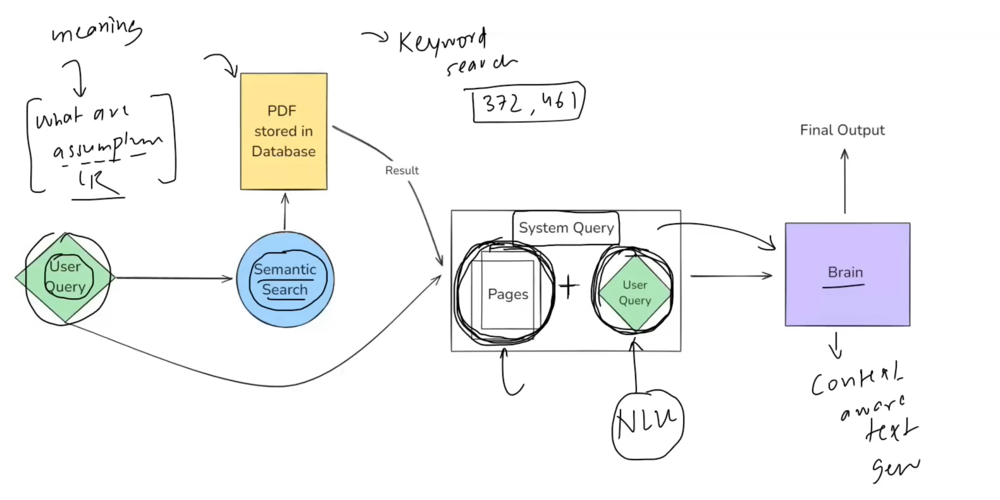
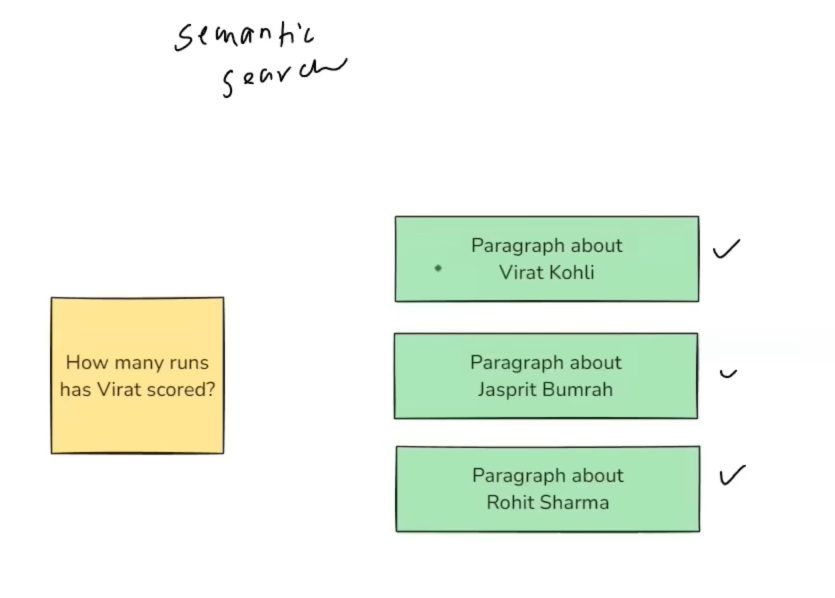
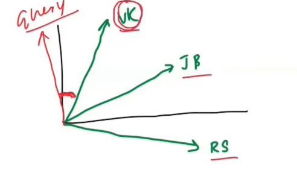
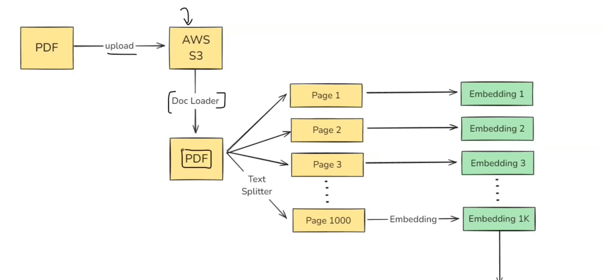
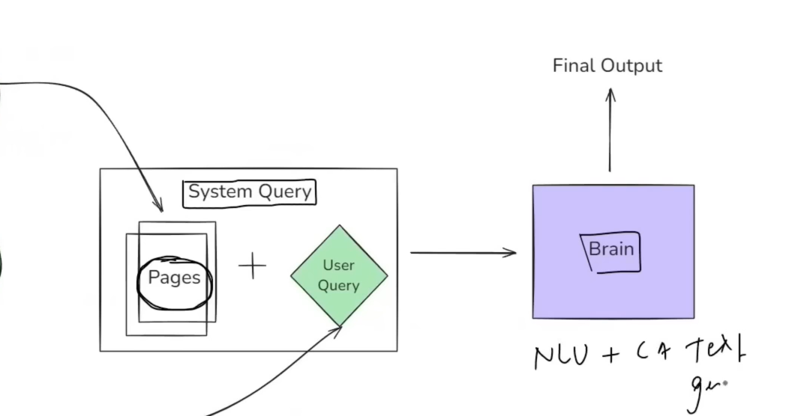

# What is LAngChain
- Opensource  Framework for developing applications powered by  LLMs.

- The Above is the System Design of an application where we can  uplod a pdf, and we can ask any question about the pdf
### Higher level EXplaination of the System
- User ask a question on the pdf as a query
- the application first does Semantic Search on the Query and also on the PDF which is stored in DB, 
- The system Retrieves Some Related Pages based on the Query through Sematic Search, Sematic Search is Done because , it gives meaning of the Question as well as the PDF, giving more Accurate Results
- These pages along with the user Query combinely sent to the BRAIN as single System Query
- Brain has 2 functionalities:
 - - It should deeply understand the MEanifn of the QUERY part of System Query, It needs to have NLU capability, Natural Language UNderstanding Capability
 - - Brain should have COntext Aware Text generation Capability, so that it can Generate the Answer to the query, based on the PDF pages selected from the pdf.

### How semantic Search Implemented:

- All three paragraphs are first Converted to Embeddings or Vectors of definite Dimension using Word2Vec or BERT or any other ways
- COnvert query into Embedding  

- After converting into vectors, we find similarity bewtweeen teh Query vector and vectors of Th e three paras
- We select the para whose SIMILARITY is more with the Query VEctor (like Cosine SIMilarity).
- Based on this we select the para

## SLow level System design of the App:
### Design of 

### Design of Converting User Query to Embeddings:

## Challenges:
- The most Challengin part is Building the Brain of the APplication
- As, we need to create a brain such that it needs to have Context Aware Text Generation and also it needs to have Natural Language UNderstanding Ability.
- This was made possible by introduction of BERT and Transformer Models
- LLM is the Brain
- Second Challenge was where to keep the Model or where to Deploy and scale the MOdel
- need to solve many Computational Problem.
- Keeping this huge Systems in Computers is not a simple thignits an Engineering Challenge.
-  These Challenges have been solved