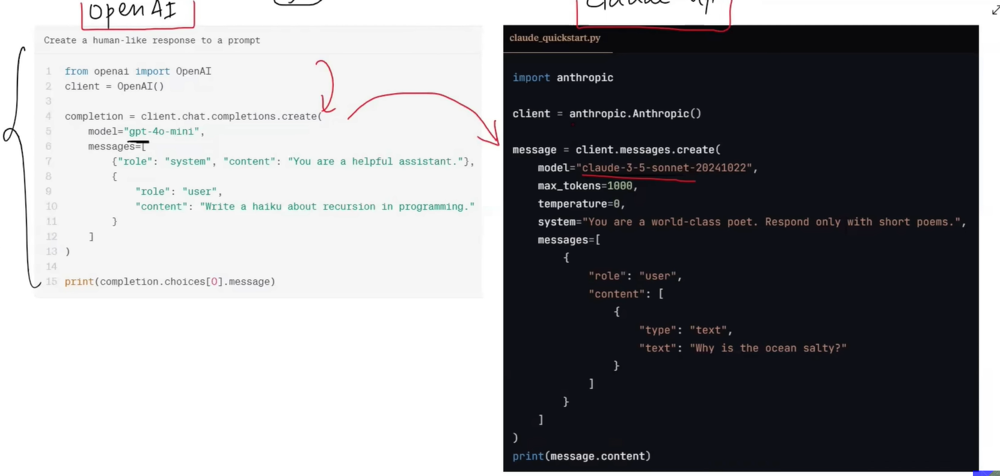
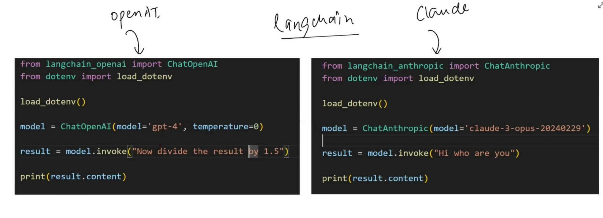

### Models:
- most important Component in LangChain.
- It provides interface through which programers can interact with any AI models
- In the world of NLP, ChatBot is the Most Popular Application, aswe alrdy know the challenge in Creating a Chatbot from **scratch** is the Brain should have Natrual Language Understanding Ability and Context Aware Text generation Ability.
- These 2 problems were solved by intro of LLM's.
- but using LLMs have created a new Problem:
 - - LLMs have been trained on All datas present in Internet. So the size of the parameters of these Models is very huge, about larger than 100GB, this is the Reason why we cant run these models in our local and Companies liek OpenAI and Claude has given API keys to communicate with these models.
 - - Those companies host the models in their Server and lets users communicate the LLMs through API Keys!  

- Imagine i have Created an Application based on OpenAI API Keys, but as the cost is higher, and if i want to change the LLM model, i need to change the Code one by one. There is no Standard platform to just shift between models before LangChain.
 
- LangChain Provides an INterface to Seamlessly interchange between LLM models such that it became easy to use any company API in a standardized fashion.
- This is Model Component in Langchain
- After using LangChain:

- We can change the models which just one line fo code, i.re changing teh model name.

## Types of LLMs we can communicate through LangChain:
- 1) Language Models(Chat Models)
 - - LLMs (text in - text out models)
- 2) Embedding Models
 - - Giving texts as input and provides Vectors as Output
 - - main use case: Semantic Search.
- We can see what are the LLMs can be communicated thorugh LangChain in LangChain Docs.