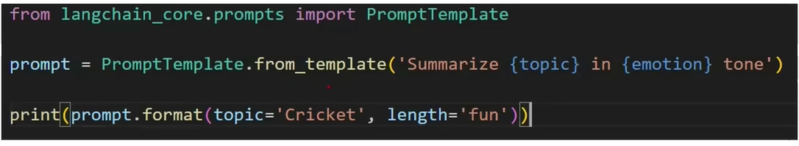
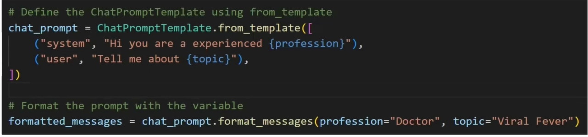
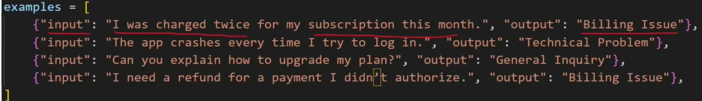
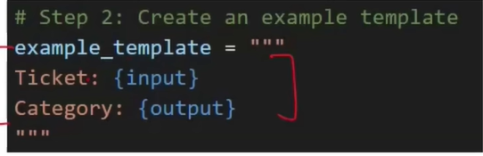
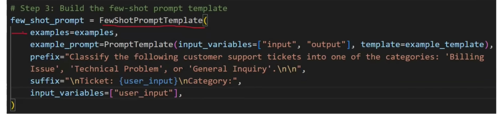
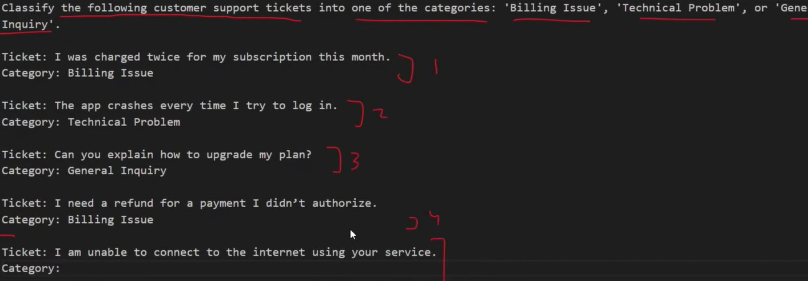

# prompts:
- Prompts are the input queries given to the LLM.
- LLM's output depends on the PROMPT you give, change of even one word can give a complete difference response.
## Types of Prompts which can be created with LangChain:
- 1) Dynamic and Reusable prompt:

- 2)  Role-Based Prompts:

- - System role defines the role to be assigned to the LLM
- - User role defines the role of te person who gives in the input query (us)
- 3) Few Short Prompting:
- Assume you are preparing chatbot for Customer Support, you can do , by giving the example Inputs alreadyb given by hte customer:

- In the last pik, what we are doing is, we are giving the prompt exampls organised as templates into teh LLM as a part of input also teh current user's quer also input, we want the LLM to predict what kind of User Query is this, is it "Billing Isssue", Technical Problem or General Enquiry.
