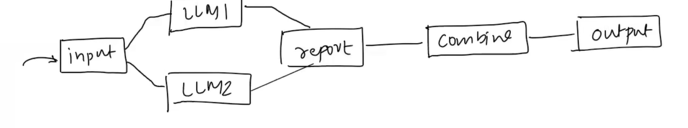
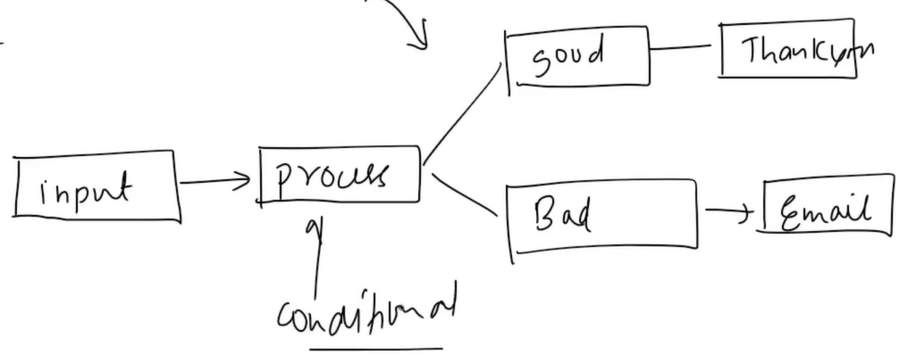

# Chains:
- Whenever we create a Pipeline we Use Chains to Create Pipeline.
- Suppose consider a example where we need to create a Application where teh user will upload english texts and teh app shd summarize it in Hindi within 100 words.
- The workflow would be:
 - - Feed teh Englsih text input into  an LLM which can translate those texts to English Language.
 - - now again, feed the Output from the Translator LLM into an LLM which can Summarize the Hindi texts less than 100 words. 
 
- We are representing this FLOW as a pipeline
- Without Chains,w e need to do alll these processes manually , i.e the flow of (processed) data between the LLMs.
- Chains automates these processes. It Takes output from one stage and redirects the output as INput to the following stage.
- Shortly, output of One stage, becomes the Input of the next stage.
- the above example is a simple Sequential Pipeline
- but we can also make Complex Pipelines
## Complex Pipelines Types:
- 1) Parallel Chain

- 2) Conditional Chains
- Lets create a AI agent, It receives FeedBack from the User
- Input to the LLM: user Feedback
- The LLM processes whether teh Feedback is Positive or Negative Feedback (The Processing happens based on some conditions)
- If the feedback is GOOD, the agent should produce an output of  "THANK YOU"
- If teh feedback is BAD, the agent should send an email to the Customer Support

