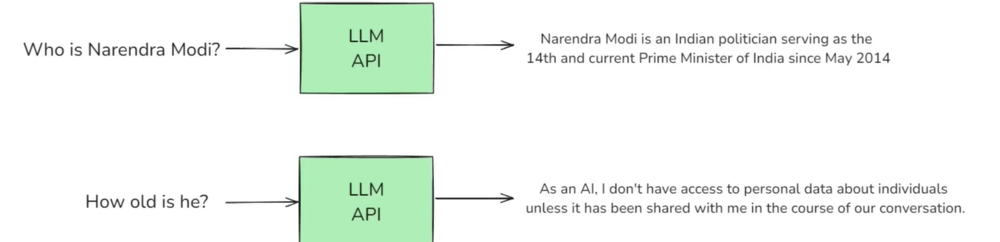

# Memory:
- ```LLM **API CALLS** ARE **STATELESS**```

- From the above example, we can infer that, LLM doesnt have any context/memory of the PRevious API Call.
- This causes a Huge problem when we are creating ChatBots.
- This Problem is Solved by **memory** component of LangChain.
## Types of memory:
- 1) **Conversational Buffer Memory**: It stores WHOLE message of both User Message as well as MEssages from LLM. And for the next API call, the whole stored chat is sent along with the API call. IF the chat history has become Huge, it will increase the Cost of processingf as the LLM needs to process the texts of whole chat.
- 2) **Conversation Buffer Window Memory**: Stores only last N interactions to avoid excessive token usage. 
- 3) **Summary Based memory**: Stores only the Summary of the whole chat, the summary is sent along with each API call.
- 4) **Custom memory**: For advanced use cases, wew can store Specialized state in a custom memory class. we will learn in deep in upciming sections.
