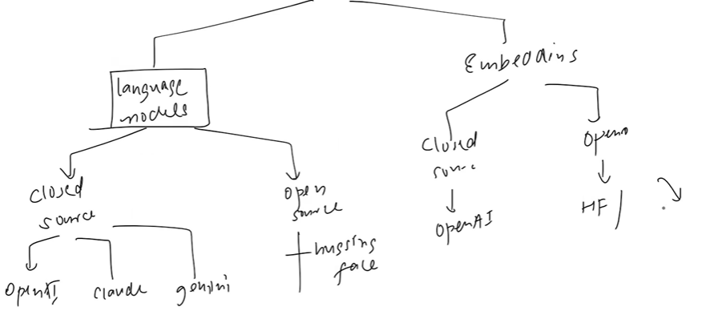
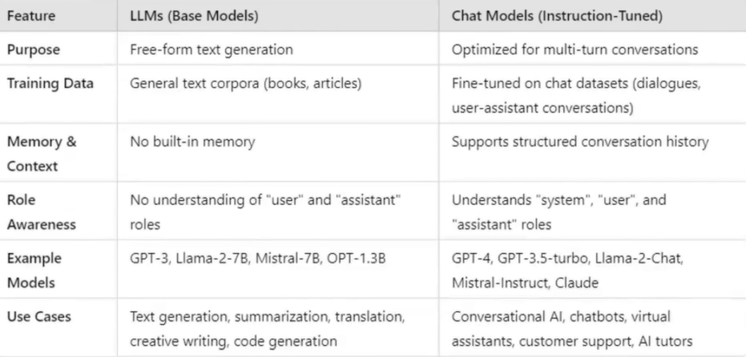
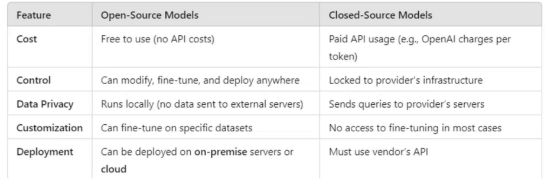
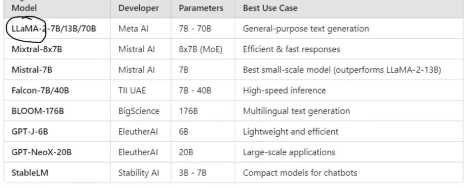
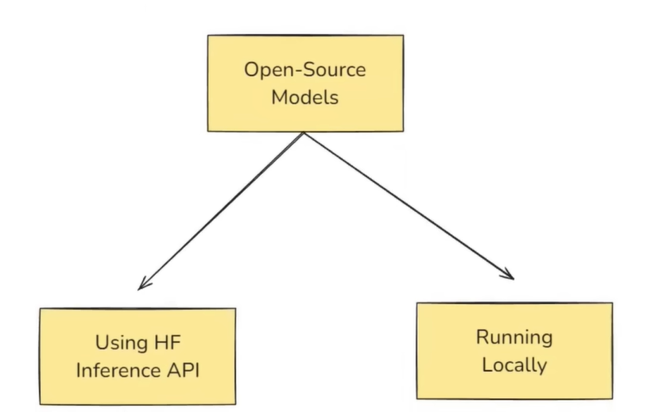
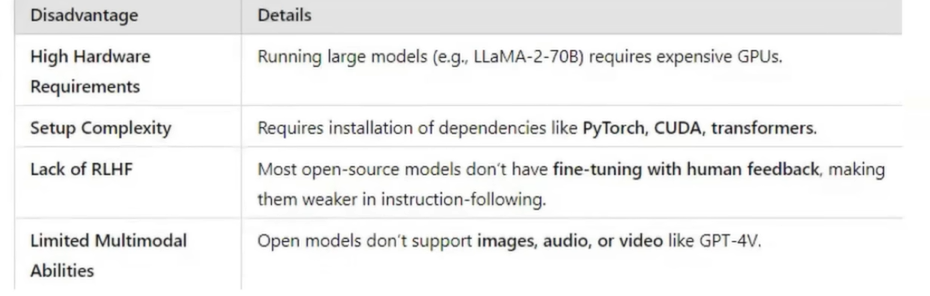

# Models:
- Model Component is Interface which Facilitates interaction with various Language Models and Embedding Models.

- Language models are text to text models
- Embedding Models are Text to Vector Embeddings MOdels, these models help in Semantic Search. useful to make RAG based Applications

## Language Models:
- Two TYpes:
 - - LLMs
 - - Chat Models
### LLMs:
- These are general Purpose Models, can be used in any type of NLP apps
- Capable of Text Generation, Text Summarization , Code Generation, Question Answering.
- right now LLMs are Replaced by Chat Models in LangChain.
- examples: GPT-3, Llama-2-7B, Mistral-7B, OPT-1.3B

### Chat Models:
- These are specialised for Conversational Task
- takes sequence of messages  as inputs and returns  chat messages as outputs
- THese are newer traditional models and are used more in comparison with LLMs
- If you wanna create a ChatBot its better to use Chat models instead of LLMs.
- Example: GPT-4 , GPT-3.5, Llama-2-chat, Claude
## Differenc ebtw LLMs and Chat Models:

#### Note: In recent versions of LangChain Chat Models are Reccomended to use rather than LLMs.

## Open Source Models vs Closed Source Models:
-  Open Source are freely available models which can be Downloaded, Modified, Fine-Tuned and Deployed without restrictions from Central Provider
- Closed Source Models like GPT-4, Claude can't be downloaded and run in local, they are owned by companies and are run in theior servers, People can COmmuncate with these models only though API keys, which is kinda costly
- We cant deploy a closed Source Model
- Open Source Modelas provides full control and customization! 

## Famous Open Source Models:

## Hugging Face:
- Largest Repository of OpenSource LLMs.
## Ways of Communicating with hugging face Models:

- Running locally involves, Downloading the model in the machine and running it(Most common way).
- **Using Hugging Face Inference API**: There is Free tier for this, we can use this for small testing purposes. After reaching the limit
    - - Best part about this is, with this API, we can communicate with thoudands of models!
    - - Models are run in Hugging face Servers.
### Disadvantages of using opensource models:
