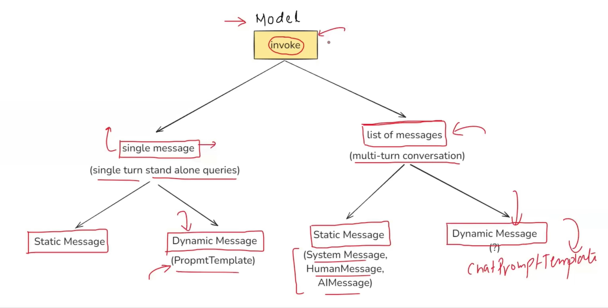

# Prompts:
- THese are input instructions or Queries given to a model to guide to its output
## Two types of PRompts:
- Static
- Dynamic

### Static:
- Static Prompts are we feed into LLM without modifying teh USer's input.
- Not used much, as we are giving the User More control in Our Application in terms of Prompting, this is because LLM's output is directly dependent upon the Given input to it.
- If a user gives a wrong topic name. The LLM will give output for teh wrong topic, which could lead to Hallucination
- We need to provide a Consistent User Experience to the User from using our LLM app, static prompting doesnt help it

### Dynamic Orompts:
- These are Templased based or Structured Prompts.
- Example: <br>


### Prompt Template:
- A PromptTemplate in LangChain is a structured way to create prompts dynamically by inserting variables into a predefined template
- nstead of
hardcoding prompts, PromptTemplate allows you to define placeholders that can be filled in at runtime with different inputs.
- Instead of hardcoding prompts, PromptTemplate allows you to define placeholders that can be filled in at runtime with different inputs.

### Why USe Prompt Templates?
- It does Validation of Input Data by default, to activate this, we need to use ```validate_template=True```
- These are **REUSABLE**: Using this we can write the prompt as F-Strings and convert it into json file through ```prompt.save(filename)``` as in <a href="./prompt_generator.py">click</a>
- **Highly coupled with LangChain Ecosystem**: We can use Prompts Easily integrated with Chains!

### Messages:
#### Types of Messages in LangChain:
- 1) System Messages- Setting the Role of the Chat Model
- 2) Human Messages
- 3) AI Messages
- With the help of these 3 types of meessages we can build a chatbot
- using this we can easily classify the messages whether the message was sent by user / the ChatModel, helping us to seamlessly store the Chat history, which willl be sent as input to the ChatModel

### Summary:



## Chat Prompt Templates:
- used when either or both System message and Human Message is Dynamic.

## Chat Prompt Template VS prompt Template:
- Chat Prompt Templates are used to create Multi-Turn message cahtbot
- Template is used to Crwate single turn message cahtbot (no context for the ChatModel)

## MessagePlaceholder:
- this helps to load the Chat HIstory into the chatPromptTemplate, it should be laid between System message adn the Human Message
