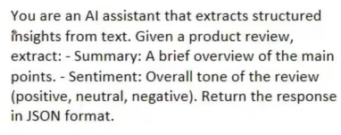

# TypedDict:
- TypedDict is a way to define a Python dictionary, by defning what Key and Values must exist.
- It ensures that the Particular key, should have Value of Specific Data Type.
- Example: String for Name, Integer for Age.
#### NOTE: It doesnt **Validates** Data at Run time, it just helps developers while Coding. It doesnt do Data Validation.
#### PyDantic is used for Data Validation.
- Ensures Dictionary follows specific Structure.
### Example:
```python
from langchain_google_genai import ChatGoogleGenerativeAI
from dotenv import load_dotenv
load_dotenv()
from typing import TypedDict

model = ChatGoogleGenerativeAI(
     model="gemini-2.5-flash",
    temperature=0.9
)

class review(TypedDict):
    summary:str
    sentiment:str

model_with_structured_op = model.with_structured_output(review)

res = model_with_structured_op.invoke("""I had the most incredible dining experience at this restaurant! The food was absolutely delicious - every dish was perfectly prepared and beautifully presented. Our server was attentive, knowledgeable, and made excellent recommendations. The atmosphere was elegant yet comfortable. I can't wait to come back and try more items from their menu. Definitely a new favorite spot!""")

print(res)
print(type(res))
```
Output:

- We are getting output as JSON format as mentioned in the Class using TypedDict

### What happens behind:
- Using this, as we define a Schema , a prompt is created, which will roughly be like:<br>


### Using ```Annotated``` to describe each attribute of the class:
```python
from typing import TypedDict, Annotated, Optional
from dotenv import load_dotenv
from langchain_google_genai import ChatGoogleGenerativeAI

load_dotenv()

class review(TypedDict):
    key_themes: Annotated[list[str], "Write down all the key themes discussed in the review as List"]
    summary: Annotated[ str, "Brief Summary of the Review"]
    sentiment: Annotated[str, "Sentiment of the Review either negative , positive or neutral"]
    pros: Annotated[Optional[list[str]],"Write down all the Pros inside a list"]
    cons: Annotated[Optional[list[str]],"Write down all the cons inside a list"]

model = ChatGoogleGenerativeAI(
     model="gemini-2.5-flash",
    temperature=0.9
)

structured_model = model.with_structured_output(review)

res = structured_model.invoke("""I had the most incredible dining experience at this restaurant! The food was absolutely delicious - every dish was perfectly prepared and beautifully presented. Our server was attentive, knowledgeable, and made excellent recommendations. The atmosphere was elegant yet comfortable. I can't wait to come back and try more items from their menu. Definitely a new favorite spot!""")

print(res)
```

- Output:
```
{'key_themes': ['food quality', 'service', 'atmosphere', 'dining experience'], 'summary': 'The restaurant provided an incredible dining experience with delicious, well-prepared, and beautifully presented food. The service was attentive and knowledgeable, and the atmosphere was elegant yet comfortable.', 'sentiment': 'extremely positive', 'pros': ['delicious food', 'perfectly prepared dishes', 'beautiful presentation', 'attentive and knowledgeable server', 'excellent recommendations', 'elegant yet comfortable atmosphere'], 'cons': []}
```

### When i use Literal in place of just str in the Sentiment:
```python
from typing import TypedDict, Annotated, Optional, Literal
from dotenv import load_dotenv
from langchain_google_genai import ChatGoogleGenerativeAI

load_dotenv()

class review(TypedDict):
    key_themes: Annotated[list[str], "Write down all the key themes discussed in the review as List"]
    summary: Annotated[ str, "Brief Summary of the Review"]
    sentiment: Annotated[Literal["positive","negative","neutral"], "Sentiment of the Review either negative , positive or neutral"]
    pros: Annotated[Optional[list[str]],"Write down all the Pros inside a list"]
    cons: Annotated[Optional[list[str]],"Write down all the cons inside a list"]

model = ChatGoogleGenerativeAI(
     model="gemini-2.5-flash",
    temperature=0.9
)

structured_model = model.with_structured_output(review)

res = structured_model.invoke("""I had the most incredible dining experience at this restaurant! The food was absolutely delicious - every dish was perfectly prepared and beautifully presented. Our server was attentive, knowledgeable, and made excellent recommendations. The atmosphere was elegant yet comfortable. I can't wait to come back and try more items from their menu. Definitely a new favorite spot!""")

print(res)
```
#### Output:
```
{'key_themes': ['food quality', 'service', 'atmosphere', 'dining experience'], 'summary': 'The user had an incredible dining experience, praising the delicious, perfectly prepared, and beautifully presented food. The server was attentive, knowledgeable, and provided excellent recommendations. The atmosphere was described as elegant yet comfortable, making it a new favorite spot.', 'sentiment': 'positive', 'pros': ['delicious food', 'perfectly prepared dishes', 'beautifully presented food', 'attentive server', 'knowledgeable server', 'excellent recommendations', 'elegant atmosphere', 'comfortable atmosphere'], 'cons': []}
```