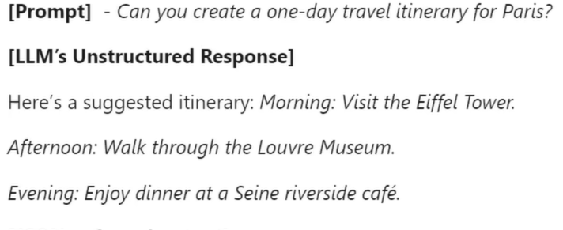
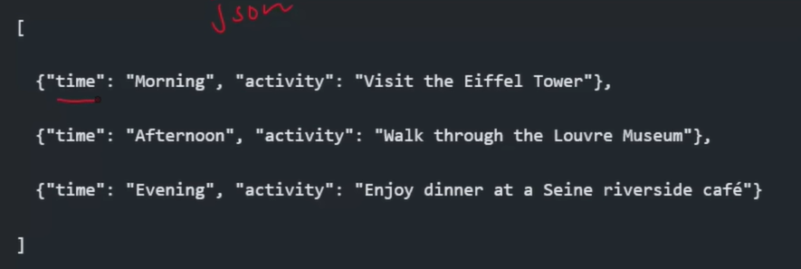
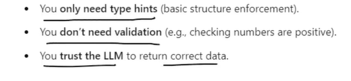
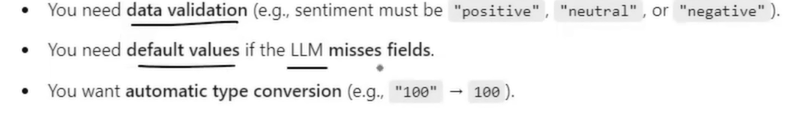
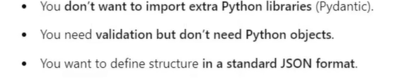

# Structured Output:
- It refers to the practice of Having Language Models return the responses in Structured Format, example: JSON rather than free-form Text.
- This makes the model's output, easier to PARSE and work with Programatically.

- Generally LLM's output is unstructured Texts. This is the reasonm why they cant be directly integrated with DBs or APIs
- With the Help of Structured Outputs, we can give a structure to the LLM's output and this resultr can be used to Interact with other Systems.
- Example: <br>


- If the model Provides the output in JSON format, its a structured Output. Example:


## Why do we need Structured Output:
- **Data Extraction**: For example, if we wanna extract Name, College name, etc from a Resume, and store the Datas into the DataBase, structured Output is MUST.
- **Building APIs**: For example you need to store Reviews of a product, for that we should code such that, Using all the Reviews, we should Just Extract/generate the Key Insights from the reviews. Like 'TOPIC', 'PROS', 'CONS', 'Sentiment of the review', these infos must be stored, this is possible only with Structured Output.
- **Agents**- These are just Chatbots on Steroids. It needs tools to do an operation

# Ways to Get Structured Output:
- There are LLMs which will give Structured output on command.
- But Some LLMs cant provide a Strucutred O/P.
- IN the models when we can get Structured Output, there is a command in langchain to use: ```with_structured_output```, using this we can Mention the format of the output, teh llm provides the output in that specified Format.
- For those LLMs which cant produce Structured output, LangChain provides ```Output parsers``` , using this we can give structure to the unstructured outputs.

# ```with_structured_output```:
- We need to define the data format before invoking the model
- **Used only to the models which can produce structured outputs**
- To do this we can use:
- - <a href="./TypedDict/readme.md">TypedDict </a>
- - <a href="./2)  Intro to Pydantic/readme.md"> Pydantic </a>  
- - json_schema

# When to use what:
## Typed Dict if:

## Pydantic if:

## Use JSON schema if:


##  When to Use What?

| Feature                     | TypedDict  | Pydantic   | JSON Schema   |
|----------------------------|-------------|----------------|------------------|
| Basic structure            | ✅           | ✅              | ✅                |
| Type enforcement           | ✅           | ✅              | ✅                |
| Data validation            | ❌           | ✅              | ✅                |
| Default values             | ❌           | ✅              | ❌                |
| Automatic conversion       | ❌           | ✅              | ❌                |
| Cross-language compatibility | ❌         | ❌              | ✅                |

## two main ways ```with_structured_output``` can force an LLM to return structured, machine-readable data.
### JSON mode:
- Forcs model to give output only as JSON
- used with gemini api and claude api

## Function Calling mode:
- Model selects and fills arguments of a predefined “function”
- Output from the Chat Model is used to Call  a function/tool/agent
- You want model output to trigger actions, Workflow automation
- use when there is Multiple possible outputs
- Used when creating agents
- Mostly used with OpenAI api


